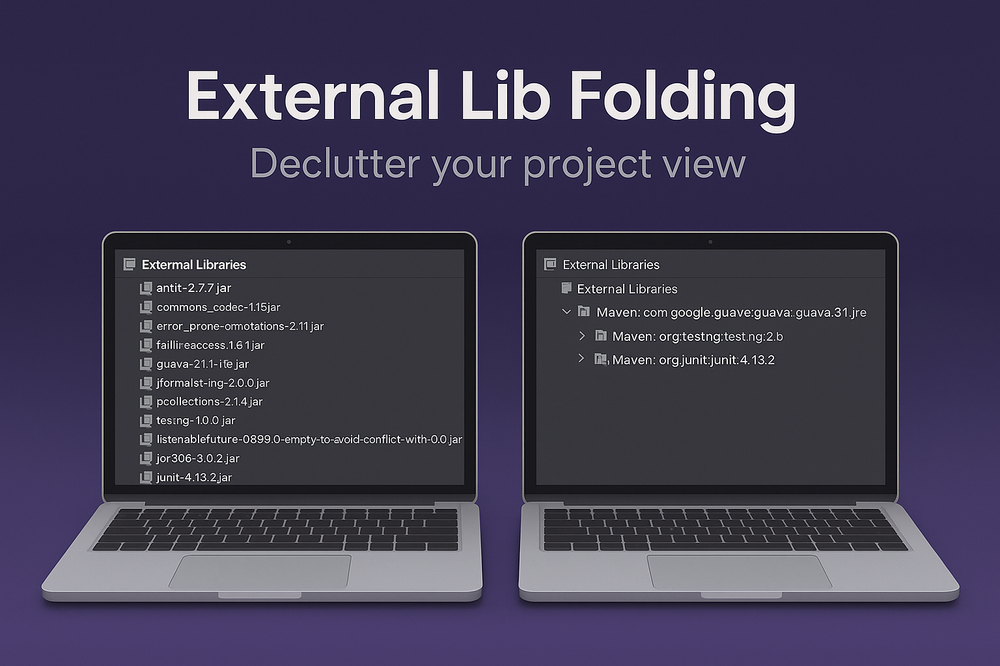
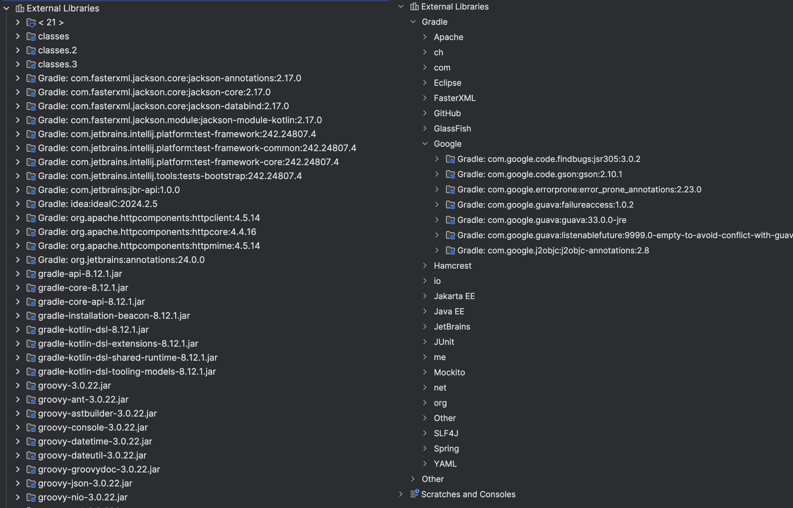
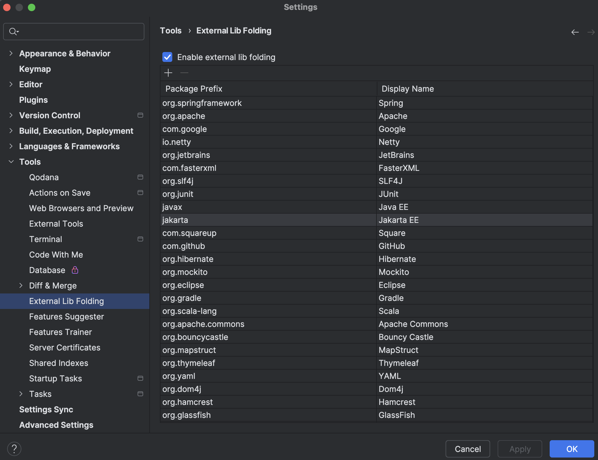

# External Lib Folding Plugin for IntelliJ IDEA

## Overview
The External Lib Folding plugin transforms the flat list in the External Libraries section of IntelliJ IDEA's Project View into a hierarchical tree structure. It organizes external dependencies by grouping them according to their source and package, making it easier to navigate and understand your project's dependencies.

## Problem Statement
By default, IntelliJ IDEA displays external libraries as a flat list in the Project View, which can become unwieldy and difficult to navigate in projects with many dependencies. This plugin addresses this issue by providing a more organized, tree-based view.

## Features
- Transforms the flat External Libraries list into a hierarchical tree structure
- Groups dependencies by their source (Maven, Gradle, etc.)
- Further organizes dependencies by package structure
- Improves navigation and readability of the External Libraries section
- Maintains all functionality of the original External Libraries view

## Installation
1. In IntelliJ IDEA, go to Settings/Preferences → Plugins
2. Click on "Marketplace" and search for "External Lib Folding"
3. Click "Install" and restart the IDE when prompted

Alternatively, you can download the plugin directly from the [JetBrains Marketplace](https://plugins.jetbrains.com/plugin/27293-external-lib-folding).

## Usage
After installation, the plugin automatically reorganizes the External Libraries section in your Project View. 

### Before and After
Here's how the External Libraries section looks before and after applying the plugin:

### Configuration
You can configure the plugin in Settings/Preferences → Tools → External Lib Folding:
- Enable or disable external lib folding
- Customize package prefix mappings for better organization

## Compatibility
- IntelliJ IDEA 2024.2 or later
- Compatible with both Community and Ultimate editions

## Development
This plugin is built using the IntelliJ Platform Plugin SDK and Kotlin.

## Feedback and Contributions
Feedback, bug reports, and contributions are welcome! Please feel free to submit issues or pull requests to the project repository.
